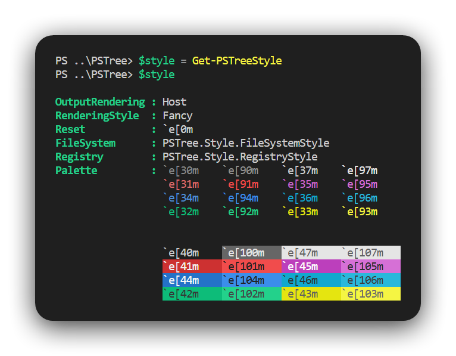
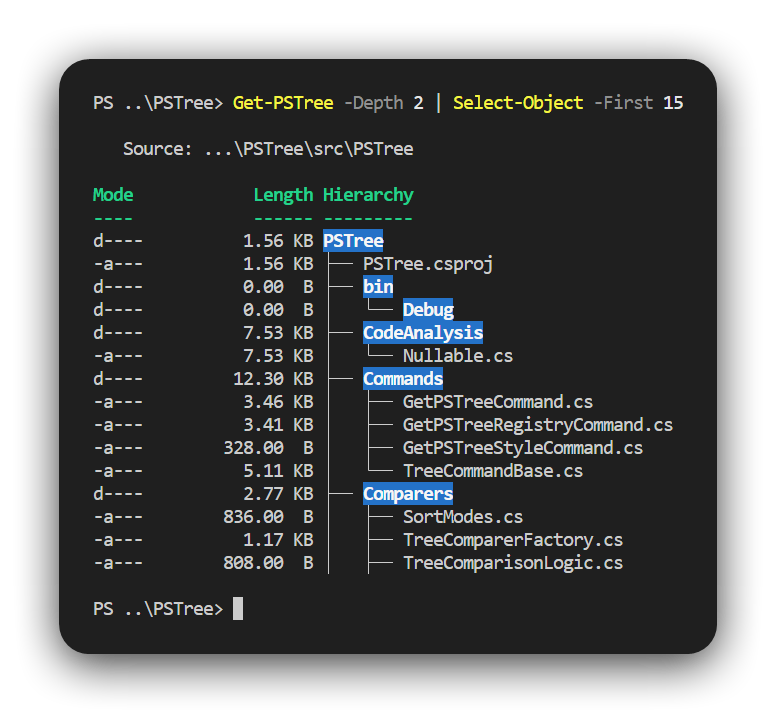
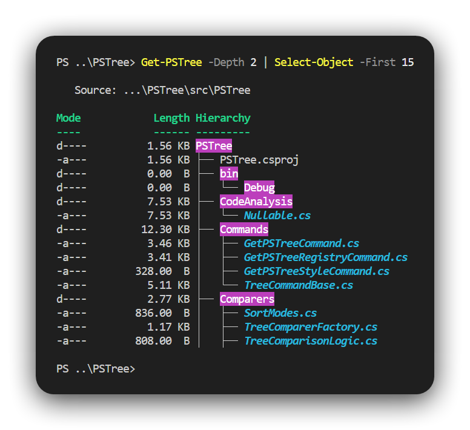
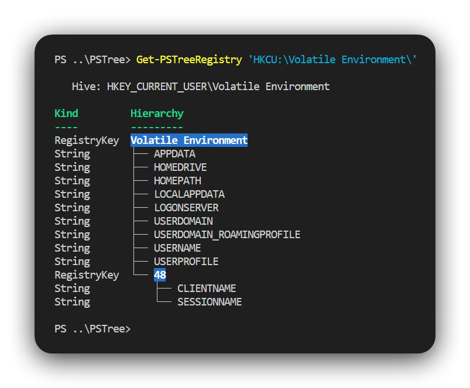
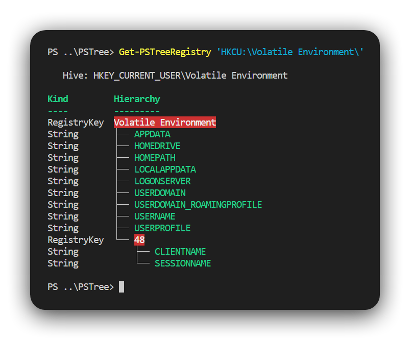
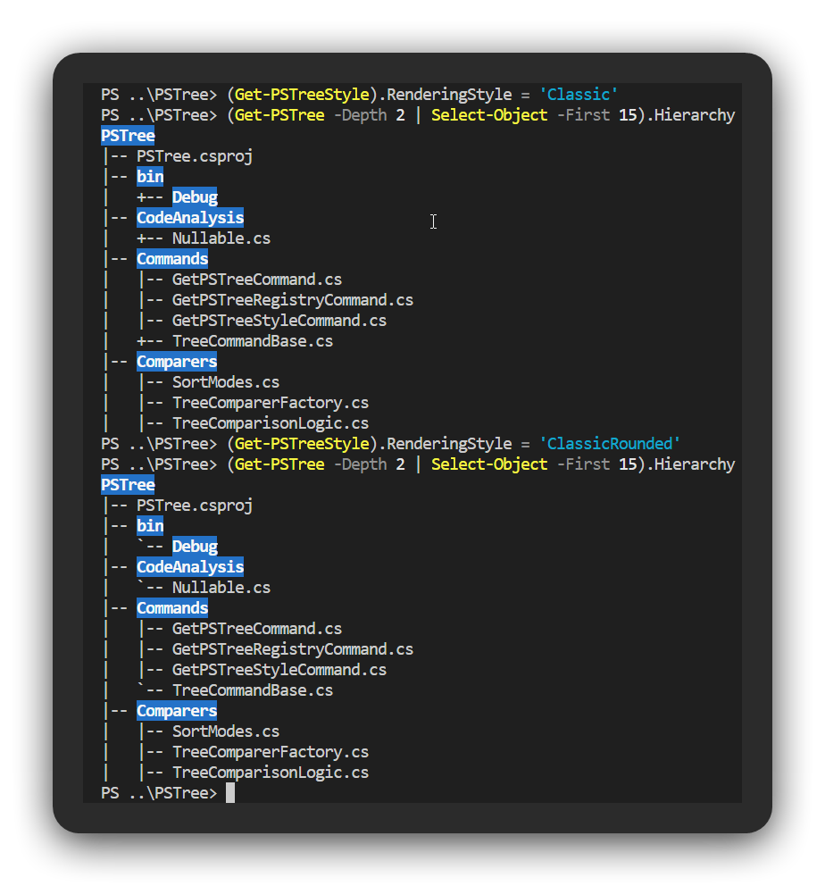

# about_TreeStyle

## TOPIC

Customizing PSTree Output with `TreeStyle`.

## SHORT DESCRIPTION

The `TreeStyle` class enables customization of the hierarchical output for `Get-PSTree` and `Get-PSTreeRegistry` cmdlets in the PSTree module.

## LONG DESCRIPTION

[__PSTree v2.2.0__](../../CHANGELOG.md#v220) and later introduces support for coloring the hierarchical output of the `Get-PSTree` and `Get-PSTreeRegistry` cmdlets using the `TreeStyle` class. This class provides a subset of features similar to those in PowerShell’s built-in [PSStyle][1].  
You can access the singleton instance through the [Get-PSTreeStyle][2] cmdlet or via the static property `[PSTree.Style.TreeStyle]::Instance`.

<div>
  
</div>

The `TreeStyle` class includes helper methods such as `ToBold()`, `ToItalic()`, `CombineSequence()` and `EscapeSequence()` to simplify working with ANSI escape sequences.

Here are its main members:

```powershell
   ReflectedType: PSTree.Style.TreeStyle

Name                  MemberType   Definition
----                  ----------   ----------
CombineSequence       Method       public string CombineSequence(string left, string right);
ResetSettings         Method       public void ResetSettings();
ToItalic              Method       public string ToItalic(string vt);
ToBold                Method       public string ToBold(string vt);
EscapeSequence        Method       public string EscapeSequence(string vt);
OutputRendering       Property     public OutputRendering OutputRendering { get; set; }
Palette               Property     public Palette Palette { get; }
Reset                 Property     public string Reset { get; }
RenderingStyle        Property     public RenderingStyle RenderingStyle { get; set; }
Instance              Property     public static TreeStyle Instance { get; }
FileSystem            Property     public FileSystemStyle FileSystem { get; }
Registry              Property     public RegistryStyle Registry { get; }
```

## CUSTOMIZING OUTPUT

### Get-PSTree

You can customize the appearance of [`Get-PSTree`][4] by modifying properties on the `TreeStyle.FileSystem` object, similar to how you would customize PSStyle.

> [!NOTE]
>
> - Customizing __symbolic links__ is not currently supported.
> - The __Executable__ accent is only available on Windows.

Consider the default output of `Get-PSTree`:

<div>
  
</div>

You can adjust colors for directories, specific file extensions, and more. Here’s an example:

```powershell
$style = Get-PSTreeStyle
$palette = $style.Palette

# Update the .ps1 extension to white text on a red background
$style.FileSystem.Extension['.ps1'] = $style.CombineSequence(
    $palette.Foreground.White,
    $palette.Background.Red)

# Add the .cs extension with bold and italic bright cyan text
$style.FileSystem.Extension['.cs'] = $style.ToItalic(
    $style.ToBold($palette.Foreground.BrightCyan))

# Update the Directory style to use a magenta background
$style.FileSystem.Directory = "`e[45m"
```

> [!TIP]
>
> - In PowerShell 6+, you can use the `` `e`` escape character. For Windows PowerShell 5.1, use `[char] 27` instead: `"$([char] 27)[45m"`.
> - Use the helper methods `.ToBold()`, `.ToItalic()`, and `.CombineSequence()` to easily build ANSI sequences.
> - To reset all customizations, call `$style.ResetSettings()`. If stored in a variable, reassign it afterward, e.g.: `$style = Get-PSTreeStyle`.

After applying these changes, the output will look like this:

<div>
  
</div>

### Get-PSTreeRegistry

Starting with [__PSTree v2.2.3__](../../CHANGELOG.md#v223), the [`Get-PSTreeRegistry`][5] cmdlet supports customizable coloring through the `PSTree.Style.RegistryStyle` object.

This allows you to define colors for both registry keys and registry values:

- __Registry keys__ — controlled by the `.RegistryKey` property.
- __Registry values__ — controlled by the `.RegistryValueKind` dictionary, which maps [RegistryValueKind][3] types to ANSI styles.

> [!NOTE]
>
> Keys in `.RegistryValueKind` can be either the enum value (integer) or the enum name as a string. For example, both ``.RegistryValueKind['ExpandString'] = "`e[45m"`` and ``.RegistryValueKind[2] = "`e[45m"`` are valid.

Here’s the default output of `Get-PSTreeRegistry` before customization:

<div>
  
</div>

You can customize it like this:

```powershell
$style = Get-PSTreeStyle
$palette = $style.Palette

# Set TreeRegistryKey instances to a red background
$style.Registry.RegistryKey = $palette.Background.Red

# Set TreeRegistryValue instances of 'String' kind to bright green foreground
$style.Registry.RegistryValueKind['String'] = $palette.Foreground.BrightGreen
```

After applying these changes, the output will reflect the new styles:

<div>
  
</div>

### Rendering Styles

[__PSTree v3.0.0__](../../CHANGELOG.md#v300) introduces the ability to customize the hierarchy lines (tree connectors) through the `RenderingStyle` property of the `TreeStyle` class.  
You can choose from the following styles:

- `Fancy` (default) — Modern box-drawing characters with straight corners.
- `FancyRounded` — Box-drawing characters with rounded corners.
- `Classic` — Traditional ASCII style using `+--` corners.
- `ClassicRounded` — ASCII style with rounded corners using `` `--``.

<div>
  
  
</div>

## DISABLING ANSI OUTPUT

Just like PowerShell’s `PSStyle`, you can disable ANSI rendering in PSTree’s output by modifying the `.OutputRendering` property of the `TreeStyle` instance. Simply set it to `'PlainText'` using the following command:

```powershell
(Get-PSTreeStyle).OutputRendering = 'PlainText'
```

This disables all ANSI-based coloring and formatting, resulting in plain text output for commands like `Get-PSTree` and `Get-PSTreeRegistry`. It’s a straightforward way to simplify the display when you don’t need the extra visual styling.

[1]: https://learn.microsoft.com/en-us/powershell/module/microsoft.powershell.core/about/about_ansi_terminals
[2]: ./Get-PSTreeStyle.md
[3]: https://learn.microsoft.com/en-us/dotnet/api/microsoft.win32.registryvaluekind
[4]: ./Get-PSTree.md
[5]: ./Get-PSTreeRegistry.md
